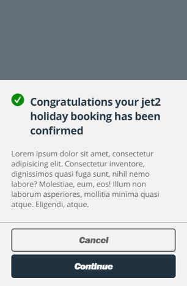
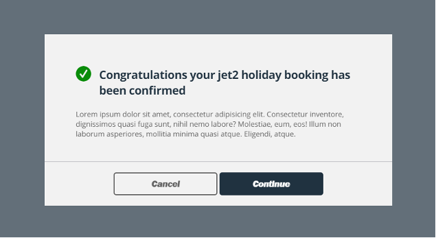

# Jet2 - Front End Assessment

For this assessment, I began by adopting a 'mobile-first' approach. Typically, I would leverage a CSS framework like TailwindCSS, which aligns seamlessly with this approach. However, in this case, a preprocessor was mandated, leading me to choose Sass/SCSS.

To ensure clarity and adherence to best practices, I utilized HTML5 semantic tags to construct the modal component. In my JavaScript implementation I encorporated arrow functions for more expressive function definitions and a ternary operator making the code more compact and easier to maintain.

While I was unable to incorporate all of the bonus requirements within the given timeframe.

### 📃 Build a mobile first responsive modal as shown in the two designs below.

Requirements:
 - [x] Mobile first
 - [x] A clear naming convention
 - [x] CSS preprocessor
 - [x] JS to fire the modal
 - [x] Must work on Chrome, FF & Safari

Bonus:
 - [ ] The ability to have more than one modal on the page
 - [ ] BEM
 - [x] ES6

